# Before optimization

## Initial render

;

## Select another year

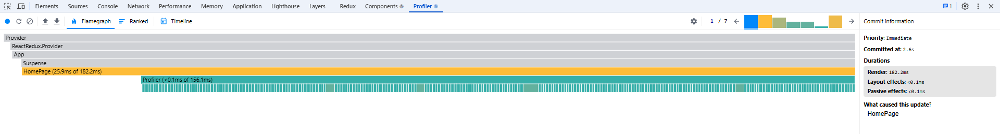;
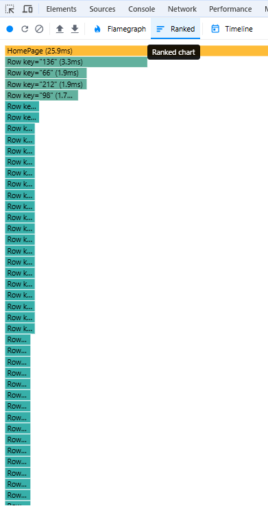;
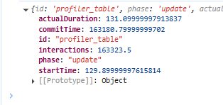;

## Search by country

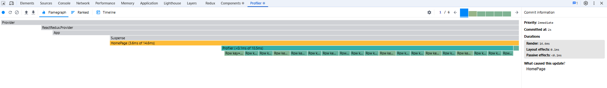;
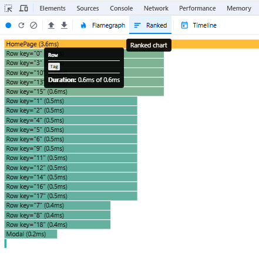;
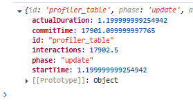;

## Filtering

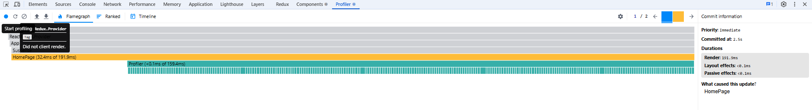;
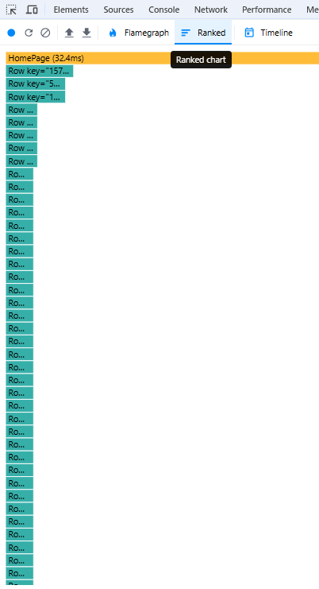;
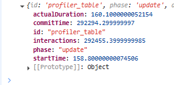;

# After optimization

## Search by country

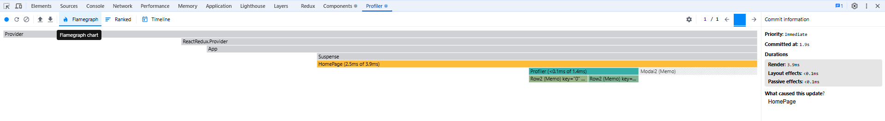;
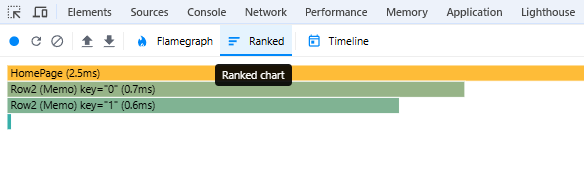;
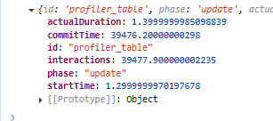;

## Select another year

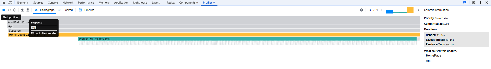;
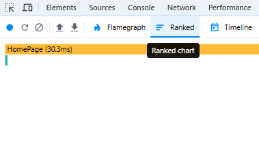;
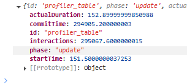;

## Filtering

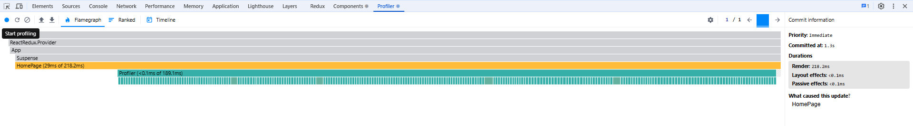;
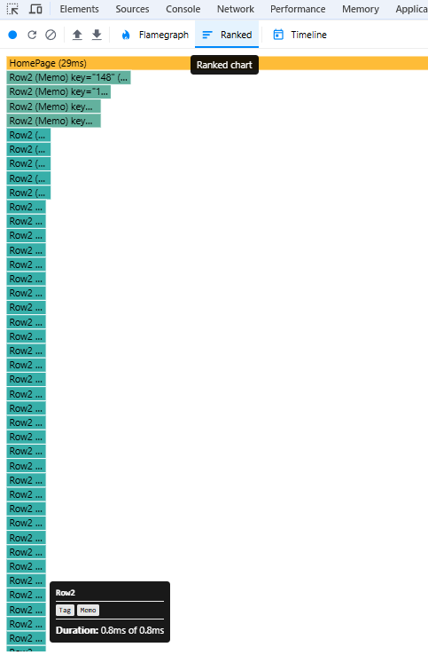;
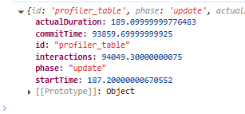;
